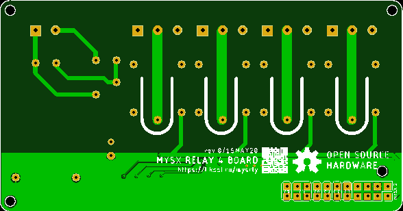

# MYSX Relay Board
Board with relays and MYSX connector

## Introduction

Switch up to 4 channels

## PCB
 

## Hardware Spec
- MH-Z19B
- SI7021
- PCB Antenna

## Hardware Spec
- PSU **HI-Link HLK-PM01** | [AliExpress](https://l.kool.ru/) | [Datasheet](http://www.hlktech.net/product_detail.php?ProId=54)
- Relay **SRD-05VDC-SL-C** | [AliExpress](https://l.kool.ru/) | [Datasheet](datasheets/SRD-05VDC-SL-C.pdf)
- ULN2003
- 
- 3P 5mm Termianl
- 2P 5mm Termianl
- Varistor
- Fuse
- Caps
- Resistors
- LED
- [1x10 pinheader](https://l.kool.ru/hdrf1r)

## Making guide

0. Make or [order PCB](https://jlcpcb.com/) 

1. Solder it together

2. Connect MCU board with relay firmware

3. Enjoy !

## Donation
If this project help you, you can give me a cup of coffee | beer | vodka :)

